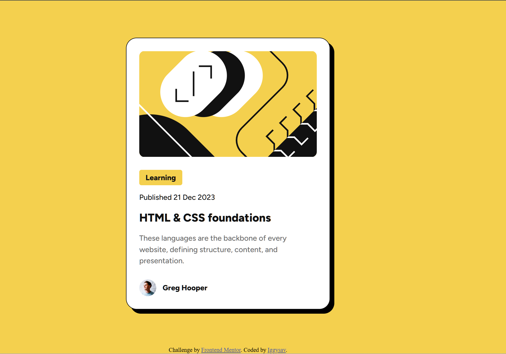

# Frontend Mentor - Blog preview card solution

This is a solution to the [Blog preview card challenge on Frontend Mentor](https://www.frontendmentor.io/challenges/blog-preview-card-ckPaj01IcS). Frontend Mentor challenges help you improve your coding skills by building realistic projects. 

## Table of contents

- [Overview](#overview)
  - [The challenge](#the-challenge)
  - [Screenshot](#screenshot)
  - [Links](#links)
- [My process](#my-process)
  - [Built with](#built-with)
  - [What I learned](#what-i-learned)
  - [Continued development](#continued-development)  
  - [AI Collaboration](#ai-collaboration)
- [Author](#author)


## Overview

### The challenge

Users should be able to:

- See hover and focus states for all interactive elements on the page

### Screenshot




### Links

- Solution URL: [GitHub repository](https://github.com/iggysav/FrontMentor/tree/master/blog-preview-card-main)
- Live Site URL: [Live site](hhttps://iggysav.github.io/FrontMentor/blog-preview-card-main/)

## My process

### Built with

- Semantic HTML5 markup
- CSS custom properties
- Flexbox


### What I learned

Learned how to use clamp() for fluid font scaling in responsive layouts
```css
 h2 {
  margin: 0;
  color: #111111;
  font-size: clamp(1.25rem, 1.6667vw, 1.5rem);
  font-weight: 800;
}
```


### Continued development

Implemented according to Figma templates. No help needed, but open to suggestions for more efficient/cleaner code alternatives.


### AI Collaboration

I consulted ChatGPT to refine my solutions and to clarify the nuances of CSS units (px, em, rem), the differences between Flexbox and Grid layouts, as well as a few other technical details.

## Author

- Frontend Mentor - [@iggysav](https://www.frontendmentor.io/profile/iggysav)
- Linkedin - [Linkedin](https://www.linkedin.com/in/savastsiuk-igor-527a1089/)
