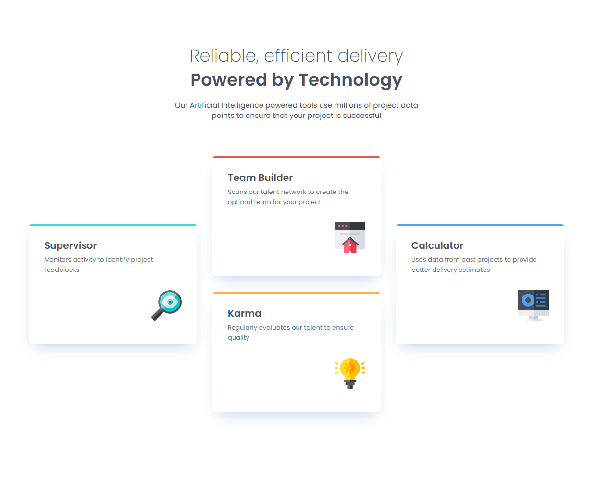

# Frontend Mentor - Four card feature section solution

This is a solution to the [Four card feature section challenge on Frontend Mentor](https://www.frontendmentor.io/challenges/four-card-feature-section-weK1eFYK). Frontend Mentor challenges help you improve your coding skills by building realistic projects. 

## Table of contents

- [Overview](#overview)
  - [The challenge](#the-challenge)
  - [Screenshot](#screenshot)
  - [Links](#links)
- [My process](#my-process)
  - [Built with](#built-with)
  - [What I learned](#what-i-learned)
  - [Continued development](#continued-development)  
  - [AI Collaboration](#ai-collaboration)
- [Author](#author)


## Overview

### The challenge

Users should be able to:

- View the optimal layout for the site depending on their device's screen size

### Screenshot




### Links

- Solution URL: [GitHub repository](https://github.com/iggysav/FrontMentor/tree/master/four-card-feature-section-master)
- Live Site URL: [Live site](https://iggysav.github.io/FrontMentor/four-card-feature-section-master)

## My process

### Built with

- Semantic HTML5 markup
- CSS custom properties
- Flexbox
- CSS Grid
- SCSS (Sass)
- BEM naming convention


### What I learned

1. I used CSS custom properties so that each card modifier only needs to declare its color once, while the shared ::before rule stays in the base card. SCSS interpolation (#{}) bridges the two worlds — SCSS variables are computed at build time, CSS variables live in the browser:

```scss
$color-supervisor: #44D3D2;
card--supervisor {
  --color-border-card: #{$color-supervisor};
}
.card::before {
  background-color: var(--color-border-card);
}
```

2. Instead of border-top (which curves with the border-radius), I used an absolutely-positioned pseudo-element clipped by overflow: hidden. That gives the "cut-off" top border the design asked for:
```scss
.card {
  position: relative;
  overflow: hidden;       
  border-radius: 8px;

  &::before {
    content: "";
    position: absolute;
    top: 0; left: 0; right: 0;
    height: 4px;
    background-color: var(--color-border-card);
  }
}
```
3. For the first time, I used CSS Grid to build a responsive layout from scratch. grid-template-areas let me describe three different card arrangements — desktop, tablet, and mobile — as readable ASCII grids, and switch between them with media queries.
```css
.cards {
  display: grid;
  grid-template-columns: repeat(3, 1fr);
  grid-template-areas:
    ". teambuilder ."
    "supervisor teambuilder calculator"
    "supervisor karma calculator"
    ". karma .";
}

@media (max-width: 1045px) {
  .cards {
    grid-template-columns: repeat(4, 1fr);
    grid-template-areas:
      ". teambuilder teambuilder ."
      "supervisor supervisor karma karma"
      ". calculator calculator .";
  }
}

@media (max-width: 700px) {
  .cards {
    grid-template-columns: 1fr;
    grid-template-areas:
      "supervisor"
      "teambuilder"
      "karma"
      "calculator";
  }
}
```


### Continued development

I've just started using CSS Grid, and I want to explore it properly — features like nested grids, named lines, and minmax() are next on my list.

I'll also continue with SCSS. I've been using variables and nesting, but mixins, partials, and functions are still new territory for me.


### AI Collaboration

I used ChatGPT as a learning assistant, as suggested in AGENTS.md. Throughout this project, an AI assistant acted as a coding mentor, helping me. The assistant encouraged me to think independently, asked guiding questions, and provided hints rather than giving complete solutions — which helped me learn more deeply.

## Author

- Frontend Mentor - [@iggysav](https://www.frontendmentor.io/profile/iggysav)
- Linkedin - [Linkedin](https://www.linkedin.com/in/savastsiuk-igor-527a1089/)


