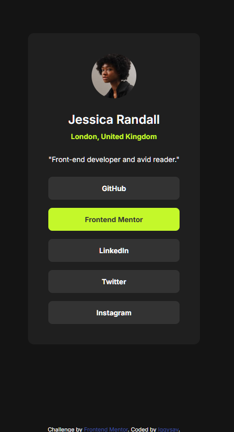

# Frontend Mentor - Social links profile solution

This is a solution to the [Social links profile challenge on Frontend Mentor](https://www.frontendmentor.io/challenges/social-links-profile-UG32l9m6dQ). Frontend Mentor challenges help you improve your coding skills by building realistic projects. 

## Table of contents

- [Overview](#overview)
  - [The challenge](#the-challenge)
  - [Screenshot](#screenshot)
  - [Links](#links)
- [My process](#my-process)
  - [Built with](#built-with)
  - [What I learned](#what-i-learned)
  - [Continued development](#continued-development) 
  - [AI Collaboration](#ai-collaboration)
- [Author](#author)


## Overview

### The challenge

Users should be able to:

- See hover and focus states for all interactive elements on the page

### Screenshot



### Links

- Solution URL: [GitHub repository](https://github.com/iggysav/FrontMentor/blob/master/social-links-profile-main)
- Live Site URL: [Live site](https://iggysav.github.io/FrontMentor/social-links-profile-main)

## My process

### Built with

- Semantic HTML5 markup
- CSS custom properties
- Flexbox

### What I learned

**Flexbox with lists**: I learned that Flexbox isn't just for ```div``` containers — it works perfectly with ```<ul>``` and ```<li>``` elements too. By using ```display: flex```, ```flex-direction: column```, and ```gap: 16px``` on the ```<ul>```, I was able to create a vertical stack of social buttons with consistent spacing, while keeping the markup semantic and accessible.

**Full-width clickable links**: To improve user experience, I made each social link fully clickable by applying ```display: block``` to the ```<a>``` tag and moving ```padding``` from the ```<li>``` to the anchor. This ensures the entire button area is interactive, not just the text:

```css
.social-links ul li a {
display: block;
padding: 12px 0;
color: inherit;
text-decoration: none;
}
```
**Two-way hover transitions**: I discovered that placing the ```transition``` property on the base element (not just ```:hover```) makes the animation smooth in both directions — on hover and when the mouse leaves. This creates a polished, professional feel:

```css
.social-links a {
transition: background-color 0.5s ease, color 0.5s ease;
}
```

### Continued development

 In this project, I used a media query to adjust padding on mobile and ```min()``` for width control. I'd like to explore ```clamp()``` and fluid typography to create more flexible layouts that adapt smoothly across all screen sizes without multiple breakpoints.
 I enjoyed working with hover transitions in this project and want to explore ```@keyframes```, advanced timing functions, and micro-interactions to make UI elements more dynamic and user-friendly.

### AI Collaboration

I used ChatGPT as a learning assistant, as suggested in AGENTS.md. It was especially helpful in clarifying how to apply Flexbox to lists and in refining the hover transitions to work smoothly in both directions.

## Author

- Frontend Mentor - [@iggysav](https://www.frontendmentor.io/profile/iggysav)
- Linkedin - [Linkedin](https://www.linkedin.com/in/savastsiuk-igor-527a1089/)
- 

