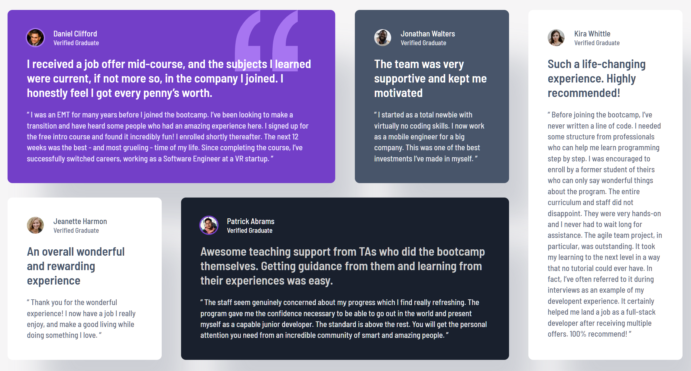

# Frontend Mentor - Testimonials grid section solution

This is a solution to the [Testimonials grid section challenge on Frontend Mentor](https://www.frontendmentor.io/challenges/testimonials-grid-section-Nnw6J7Un7). Frontend Mentor challenges help you improve your coding skills by building realistic projects. 

## Table of contents

- [Overview](#overview)
  - [The challenge](#the-challenge)
  - [Screenshot](#screenshot)
  - [Links](#links)
- [My process](#my-process)
  - [Built with](#built-with)
  - [What I learned](#what-i-learned)
  - [Continued development](#continued-development) 
  - [AI Collaboration](#ai-collaboration)
- [Author](#author)


## Overview

### The challenge

Users should be able to:

- View the optimal layout for the site depending on their device's screen size

### Screenshot




### Links

- Solution URL: [GitHub repository](https://github.com/iggysav/FrontMentor/tree/master/testimonials-grid-section-main)
- Live Site URL: [Live site](https://iggysav.github.io/FrontMentor/testimonials-grid-section-main)

## My process

### Built with

- Semantic HTML5 markup
- CSS custom properties
- Flexbox
- CSS Grid
- SCSS (Sass)
- BEM naming convention


### What I learned

#### 1. Visually hidden content for accessibility

I used the `.visually-hidden` utility to add an `<h1>` that's only
visible to screen readers. This keeps the heading hierarchy correct:
a hidden `<h1>` for the page, visible `<h2>` for each testimonial.

```css
.visually-hidden {
  position: absolute;
  width: 1px;
  height: 1px;
  clip: rect(0, 0, 0, 0);
  overflow: hidden;
}
```
#### 2. Separating layout from semantics
   I used BEM classes (`card--purple`, `card__author`) for semantics and
   separate utility classes (`rev-1`…`rev-5`) for grid positions. This
   keeps concerns separated: BEM describes _what_ an element is, grid
   classes describe _where_ it goes.

```html
<article class="card rev-1 card--purple">
```

### Continued development

I've just started using CSS Grid, and I want to explore it properly — features like nested grids, named lines, and minmax() are next on my list.
The breakpoints work, but the transitions between them feel abrupt — cards suddenly shrink, spacing shifts. I'd like to learn how to build fluid layouts where sizes adapt smoothly to the viewport, using `clamp()`, `min()`, `max()`, and relative units. Ideally, this would reduce the number of media queries or remove them entirely.

I'll also continue with SCSS. I've been using variables and nesting, but mixins, partials, and functions are still new territory for me.


### AI Collaboration

I used ChatGPT as a learning assistant, as suggested in AGENTS.md. Throughout this project, an AI assistant acted as a coding mentor, helping me. The assistant encouraged me to think independently, asked guiding questions, and provided hints rather than giving complete solutions — which helped me learn more deeply.


## Author

- Frontend Mentor - [@iggysav](https://www.frontendmentor.io/profile/iggysav)
- Linkedin - [Linkedin](https://www.linkedin.com/in/savastsiuk-igor-527a1089/)
